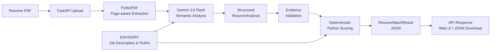

# AI Resume Matcher

> Evidence-based Resume-to-Job Description (JD) analysis for the EDVISORY tech AI & Data Solution Intern assignment.


> [!IMPORTANT]
> **JD Match Score** is decision support based on evidence alignment with a
> fixed Job Description (JD) and rubric. It is not a hiring probability, candidate
> quality score, performance prediction, or automatic hire/reject decision.

## Overview

AI Resume Matcher accepts a PDF resume, extracts its text, and compares it
with the authoritative EDVISORY AI & Data Solution Intern Job Description (JD). A
configured Gemini model performs structured semantic analysis; Python then
verifies the evidence and calculates the score deterministically. The result
is available through a JSON API and a browser-based Web UI.

It supports English, Thai, and mixed Thai/English resume content
and produces explainable criterion-level analysis for human review.

## Key capabilities

- PDF upload and page-aware text extraction
- Structured Gemini semantic analysis
- Exact resume evidence with page and source provenance
- Deterministic evidence validation and Python scoring
- Direct, equivalent, transferable, adjacent, and none match types
- Candidate name as descriptive metadata only; it does not affect scoring
- Bounded uploads and structured API errors
- Browser Web UI with category navigation and JSON download
- Deterministic automated tests

## Tech stack

| Layer | Technology | Responsibility |
|---|---|---|
| Language | Python 3.12+ | Application logic and deterministic scoring |
| API | FastAPI + Uvicorn | HTTP API, Web UI hosting, and Swagger/OpenAPI |
| PDF processing | PyMuPDF | PDF validation and page-aware text extraction |
| LLM | Gemini 3.6 Flash | Multilingual semantic resume analysis |
| LLM integration | Google Gen AI SDK | Structured Gemini API communication |
| Validation | Pydantic and pydantic-settings | Strict data and configuration contracts |
| Testing | Pytest and HTTPX | Deterministic application-contract tests |

## Web UI

Open the interface at `GET /`:

1. Upload or drag and drop a PDF resume.
2. Click **Analyze Resume**.
3. The backend runs the resume-matching pipeline.
4. The result shows the candidate name when available, job and company, and
   the overall JD Match Score with a deterministic overall score rationale.
5. Four category cards show **Education**, **Skills**, **Knowledge**, and
   **Tools**; Education is selected by default.
6. Select another category to show only that category's criterion details.
7. Criterion accordions expose the score, match type, evidence level,
   effective rating, exact resume evidence, page/source, and Thai rationale.
8. Click **Download JSON** to download the current structured result.

Category switching is client-side. It does not trigger another analysis or
Gemini request. The current result is held only in browser memory: refreshing
or closing and reopening the page clears the displayed result. Refreshing does
not start a new request; a new Gemini request occurs only when a resume is
submitted for analysis again.

## Pipeline and Architecture



Gemini is responsible for semantic interpretation of Thai, English, and
mixed-language resume content, match-type classification, evidence level,
exact evidence selection, rationale, and explicitly stated candidate metadata.

Python is responsible for PDF validation and extraction, schema and
criterion-completeness checks, evidence quote/page verification, match caps,
effective ratings, criterion/category/overall scoring, deterministic overall
score rationale, API and error handling, and safe result filenames.

**Gemini does not calculate the final JD Match Score or make a hiring
decision.** Python scoring is deterministic for the same validated structured
analysis. However, separate Gemini analysis requests may produce slightly
different semantic classifications or evidence levels.

For the complete request, validation, scoring, output, and error-handling flow,
see [docs/WORKFLOW.md](docs/WORKFLOW.md).

## Quick start

Python 3.12 or newer is required.

### Windows PowerShell

```powershell
py -3.12 -m venv .venv
.\.venv\Scripts\Activate.ps1
python -m pip install -e ".[dev]"
Copy-Item .env.example .env
```

### macOS / Linux

```bash
python3 -m venv .venv
source .venv/bin/activate
python -m pip install -e ".[dev]"
cp .env.example .env
```

Edit `.env` and set the server-side API key:

```dotenv
GEMINI_API_KEY=<your key>
GEMINI_MODEL=gemini-3.6-flash
```
Run the application:

```bash
python -m uvicorn app.main:app --reload
```

Then open:

- Web UI: <http://127.0.0.1:8000/>
- Swagger UI: <http://127.0.0.1:8000/docs>
- Health check: <http://127.0.0.1:8000/health>

## API Reference

### Endpoints

| Method | Endpoint | Description |
|---|---|---|
| `GET` | `/` | Browser-based Web UI |
| `GET` | `/health` | Application health check |
| `POST` | `/api/v1/resume-match` | Analyze one PDF resume against the fixed JD and rubric |
| `GET` | `/docs` | Swagger/OpenAPI documentation |

### Resume analysis

`POST /api/v1/resume-match`

It accepts one text-based PDF in the multipart field `resume` and returns a
structured `ResumeMatchResult` JSON document.

```bash
curl -X POST http://127.0.0.1:8000/api/v1/resume-match \
  -F "resume=@resume.pdf;type=application/pdf"
```

Uploads are limited to 10 MiB and 10 pages.

Swagger/OpenAPI documentation remains available at /docs. Successful and
centrally mapped application-error responses use Cache-Control: no-store.
Successful responses remain application/json and include a safe
Content-Disposition filename based only on the sanitized candidate name, or
resume_match_result.json when no name is available. The server does not
persist the downloaded result.

## Scoring rubric

The JD Match Score is on a 0–100 scale with these fixed category totals:

| Category | Maximum |
|---|---:|
| Education | 10 |
| Skills | 40 |
| Knowledge | 25 |
| Tools | 25 |

Evidence levels range from 0–4:

- 0: no sufficient evidence
- 1: mention or exposure
- 2: limited practical evidence
- 3: clear hands-on evidence
- 4: strong depth, ownership, or outcomes

The effective rating and criterion score are:

~~~text
effective_rating = min(evidence_level, match_cap)
criterion_score = criterion_weight * effective_rating / 4
~~~

| Match type | Maximum rating |
|---|---:|
| direct | 4 |
| equivalent | 4 |
| transferable | 3 |
| adjacent | 1 |
| none | 0 |

The machine-readable [EDVISORY JD configuration](data/jobs/edvisory_ai_data_solution_intern.json)
is the source of truth for criterion definitions, weights, rating policy,
match caps, and validation targets.

## Evidence and explainability

Every scored criterion is tied to evidence containing:

- an exact contiguous quote copied from the resume
- the one-based PDF page
- the source type
- a neutral Thai rationale explaining the relationship to the criterion

Before scoring, the backend verifies that each cited quote exists on its
claimed page after the project's PDF normalization rules. Evidence text is
not translated, paraphrased, reconstructed, invented, or combined from
multiple pages. If no exact supporting excerpt exists, the criterion uses
`match_type = none`, `evidence_level = 0`, and an empty evidence list.

Absence of evidence does not prove that a candidate lacks the skill.

## Security and privacy

- Uploaded resume content is treated as untrusted data, not as application
  instructions.
- The API key is server-side only; it is not exposed to the Web UI.
- The frontend renders result data with safe DOM APIs rather than unsafe HTML
  injection.
- PDF upload size and page count are bounded, and processing is in memory.
- Result filenames are sanitized and cannot create directories or path
  traversal.
- The application does not use localStorage, sessionStorage, or IndexedDB for
  result persistence.
- Successful and centrally mapped error responses use Cache-Control: no-store
  where implemented.
- Relevant resume content is sent to the configured Gemini provider for
  analysis; this project does not claim that resumes remain entirely on the
  local machine.

## Current limitations

- Text-based PDFs only; scanned or image-only resumes have no OCR support.
- One resume per request; no batch processing or candidate ranking.
- The EDVISORY Job Description (JD) and scoring rubric are fixed for this assignment.
- No authentication, user accounts, database, history, or production
  deployment is included.
- Web UI results are memory-only and disappear on refresh or page close.
- No RAG or LangChain integration is included.
- A new Gemini request may vary in semantic analysis, so repeated submissions
  of the same resume are not guaranteed to produce identical final scores.
- Gemini requires a configured API key, network access, available quota, and a
  supported configured model.

## Example result

[examples/example_result.json](examples/example_result.json) is a synthetic
production-shaped result generated without Gemini. It is not a real candidate
record and contains no real resume or personal information. The deterministic
generator is [examples/generate_example_result.py](examples/generate_example_result.py).

## Testing and evaluation

Run the deterministic suite from the repository root:

~~~powershell
.\.venv\Scripts\python.exe -m pytest --basetemp ..\pytest-temp-ai-resume -p no:cacheprovider
.\.venv\Scripts\python.exe -m pip check
~~~

The suite covers PDF validation, strict schemas, evidence validation, scoring,
pipeline object flow, API and error behavior, and Web UI/static contracts. It
makes no Gemini request and is not browser end-to-end automation.

An opt-in live synthetic evaluator exists at `python -m evals.run_live_eval`,
but it calls Gemini, consumes quota, and is not part of the normal
deterministic test run.

## Repository structure

~~~text
app/
  api/                  HTTP routes and error handlers
  core/                 application configuration
  models/               strict data contracts
  prompts/              trusted Gemini prompt construction
  services/             PDF, analysis, validation, scoring, and pipeline
  web/
    index.html          Web UI markup
    styles.css          Web UI styling
    app.js              Web UI behavior
data/
  jobs/                 authoritative EDVISORY JD and rubric
docs/                   workflow documentation
evals/                  opt-in synthetic live evaluation
examples/               synthetic result and generator
tests/                  deterministic automated tests
~~~

## Project references

- [Detailed workflow](docs/WORKFLOW.md) — request, validation, scoring, output,
  and error-handling flow
- [Synthetic example result](examples/example_result.json)
- [Example generator](examples/generate_example_result.py)
- [Authoritative JD configuration](data/jobs/edvisory_ai_data_solution_intern.json)