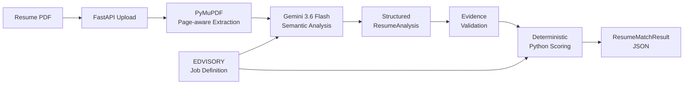

# AI Resume Matcher

> Evidence-based multilingual Resume-to-JD matching API with LLM-powered semantic analysis and deterministic Python scoring.


> [!IMPORTANT]
> The JD Match Score is a decision-support signal, not a hiring probability,
> candidate-quality score, predicted job performance, or automatic hire/reject
> decision.

## Overview

AI Resume Matcher is assignment that analyzes one PDF resume
against the EDVISORY AI & Data Solution Intern job definition. It supports
Thai, English, and mixed-language resume text and produces an explainable JD
Match Score for human decision support.

## Key features

- PDF resume upload through FastAPI and Swagger/OpenAPI
- Thai, English, and mixed-language semantic matching
- Strict, structured Gemini analysis
- Exact resume evidence quotations with page-aware provenance
- Deterministic Python scoring
- `direct`, `equivalent`, `transferable`, `adjacent`, and `none` matching
- Descriptive candidate-name metadata excluded from scoring
- Structured public API errors and bounded upload handling
- Deterministic automated tests
- Opt-in live synthetic Gemini evaluation

## 🛠 Tech Stack

| Layer | Technology | Responsibility |
|---|---|---|
| Language | Python 3.12+ | Application logic and deterministic scoring |
| API | FastAPI + Uvicorn | Resume upload API and Swagger/OpenAPI interface |
| PDF processing | PyMuPDF | Page-aware PDF validation and text extraction |
| LLM | Gemini 3.6 Flash | Multilingual semantic resume analysis |
| LLM integration | Google Gen AI SDK | Structured Gemini API communication |
| Validation | Pydantic | Strict analysis, configuration, and response contracts |
| Testing | Pytest | Deterministic automated testing |

## ⚙️ How It Works

1. FastAPI receives one PDF through `POST /api/v1/resume-match`.
2. The API reads the upload within a fixed bound and validates the PDF.
3. PyMuPDF extracts and preserves resume text page by page.
4. Gemini 3.6 Flash compares the resume with the authoritative EDVISORY job
   definition.
5. Gemini returns a structured `ResumeAnalysis` containing candidate-name and
   education metadata plus each criterion's `match_type`, `evidence_level`,
   exact evidence quote, page number, source type, and Thai rationale.
6. Python validates the structure and criterion coverage, verifies every quote
   on its claimed page, applies match caps and rubric weights, and calculates
   effective ratings plus criterion, category, and overall scores.
7. FastAPI returns `ResumeMatchResult` JSON with a sanitized download filename.

**Gemini does not calculate the final JD Match Score.**

## 🔄 Workflow



For the complete request, validation, scoring, output, and typed-error flow,
see [docs/WORKFLOW.md](docs/WORKFLOW.md).

## Key Design Decisions

| Decision | Why |
|---|---|
| Gemini handles semantics, not scoring | Keeps score arithmetic out of a probabilistic model |
| Python owns scoring | Makes calculations deterministic and auditable for a given structured analysis |
| Exact evidence verification | Prevents unsupported or invented LLM evidence from reaching scoring |
| Page-aware provenance | Makes every scored evidence item traceable to its resume page |
| Match-type caps | Prevents transferable and adjacent evidence from receiving direct-match credit |
| Resume treated as untrusted input | Prevents resume text from redefining trusted application instructions |
| Candidate name excluded from scoring | Keeps identity metadata out of JD alignment calculations |
| Human-owned final decision | Supports reviewer judgment instead of automating hiring decisions |

## Architecture and responsibility boundaries

| Gemini semantic layer | Python enforcement layer |
|---|---|
| Interprets multilingual resume meaning | Handles bounded uploads and validates PDFs |
| Matches evidence to criteria | Extracts page-aware PDF text |
| Assigns `match_type` and `evidence_level` | Validates strict schemas and criterion completeness |
| Selects exact evidence and attributes its page | Verifies exact evidence on the claimed page |
| Produces a neutral Thai rationale | Applies match caps, effective ratings, and rubric weights |
| Extracts an explicitly stated candidate name | Calculates criterion, category, and overall scores |
| Does not calculate scores, apply rubric arithmetic, or make hire/reject decisions | Enforces API result and error contracts |

In short: **LLM = semantic interpretation; Python = deterministic
enforcement.** Python scoring is deterministic for a given `ResumeAnalysis`.
Because semantic assessment uses an LLM, `match_type` and `evidence_level` may
show limited run-to-run variation for the same resume.

## Scoring

The JD Match Score ranges from 0 to 100:

```text
effective_rating = min(evidence_level, match_cap)

criterion_score =
    criterion_weight * effective_rating / 4
```

Evidence levels:

- `0` — no sufficient evidence
- `1` — mention or exposure
- `2` — limited practical evidence
- `3` — clear hands-on evidence
- `4` — strong depth, ownership, or outcomes

| Match Type | Cap |
|---|---:|
| `direct` | 4 |
| `equivalent` | 4 |
| `transferable` | 3 |
| `adjacent` | 1 |
| `none` | 0 |

The [EDVISORY job definition](data/jobs/edvisory_ai_data_solution_intern.json)
is the authoritative machine-readable JD, rubric, weights, rating policy, match
policy, and evidence policy.

## Quick start

Python 3.12 or newer is required.

```bash
python -m venv .venv
```

Windows PowerShell:

```powershell
.venv\Scripts\Activate.ps1
python -m pip install -e ".[dev]"
Copy-Item .env.example .env
```

macOS/Linux:

```bash
source .venv/bin/activate
python -m pip install -e ".[dev]"
cp .env.example .env
```

Set the Gemini configuration in the local `.env` file:

```dotenv
GEMINI_API_KEY=<your key>
GEMINI_MODEL=gemini-3.6-flash
```

Never commit `.env` or a real API key.

Start the application:

```bash
uvicorn app.main:app --reload
```

- Swagger UI: <http://127.0.0.1:8000/docs>
- Health check: <http://127.0.0.1:8000/health>
- Endpoint: `POST /api/v1/resume-match`

Try it with Swagger:

1. Open `http://127.0.0.1:8000/docs`
2. Expand `POST /api/v1/resume-match`
3. Click **Try it out**
4. Upload a PDF in the `resume` field
5. Click **Execute**
6. Review the JD Match Score, evidence, and rationale

Or call the API directly:

```bash
curl -X POST http://127.0.0.1:8000/api/v1/resume-match \
  -F "resume=@resume.pdf;type=application/pdf"
```

Uploads are limited to 10 MiB and 10 pages.

## API response

Short representative response:

```json
{
  "candidate_name": "Synthetic Candidate",
  "job_id": "edvisory_ai_data_solution_intern",
  "company": "EDVISORY",
  "job_title": "AI & Data Solution Intern",
  "score_name": "JD Match Score",
  "overall_score": 68.25,
  "maximum_score": 100,
  "category_scores": [...],
  "criterion_scores": [...]
}
```

`candidate_name` is descriptive metadata only and is excluded from scoring.
See the [full synthetic production-shaped example](examples/example_result.json).

A successful response remains `application/json` and uses
`Cache-Control: no-store`. Its `Content-Disposition` filename is based only on
the sanitized candidate name, for example
`Synthetic_Candidate_resume_match.json`, or falls back to
`resume_match_result.json`. The server does not persist this file.

## Evidence and explainability

Every non-`none` criterion includes one or more evidence objects with an exact,
verbatim resume quotation, its one-based page number, and its source type.

```text
evidence
= exact text copied from the resume

rationale
= Thai explanation of why that evidence relates to the criterion
```

Before scoring, Python verifies that the normalized exact quotation exists on
the claimed page. The LLM is instructed not to translate, paraphrase,
reconstruct, invent, or combine unrelated fragments into one evidence quote. If
no exact supporting excerpt exists, the criterion must use `none`, evidence
level `0`, and an empty evidence list.

Absence of evidence is not evidence of inability.

## Testing and evaluation

Deterministic validation:

```powershell
python -m pytest --basetemp ..\pytest-temp-ai-resume -p no:cacheprovider
python -m pip check
```

The Pytest suite is deterministic, sends no Gemini requests, consumes no API
quota, and validates application contracts and scoring behavior.

Opt-in live synthetic evaluation:

```powershell
python -m evals.run_live_eval
```

The live evaluator uses the Gemini API, consumes quota, and tests semantic
behavior with synthetic strong direct, weak keyword-only, equivalent,
transferable, adjacent, Thai, mixed-language, missing-information,
prompt-injection, page/evidence-provenance, and unrelated-candidate scenarios.
Its semantic results may show limited run-to-run variation.

## Security and privacy

- Resume content is treated as untrusted input; embedded resume instructions
  are not trusted application commands.
- PDF processing uses in-memory bytes and page text; the application creates no
  persistent resume files and has no application-managed resume database.
- Full resume pages and full text are not intentionally returned.
- `.env` is ignored by Git, and the Gemini API key must remain local.
- Candidate name is the only intentional candidate identity metadata in output
  and never affects scoring.
- Email, phone, address, age, gender, nationality, and photo metadata are not
  extracted into output.
- Output filenames are sanitized and cannot create paths.
- Successful and centrally mapped application-error responses use
  `Cache-Control: no-store`.

## Current limitations

- Text-based PDFs only; no OCR for scanned or image-only resumes
- One resume per request; no batch candidate ranking
- Fixed EDVISORY job definition for this assignment
- Gemini API/network, quota, and configured-model availability dependencies
- Possible semantic run-to-run variation
- No authentication, application database, rate limiting, production
  deployment, or frontend
- Human decision-support only; not an autonomous hiring system

## Repository structure

```text
app/
  api/       HTTP routes and error handlers
  core/      application configuration
  models/    strict data contracts
  prompts/   trusted Gemini prompt construction
  services/  PDF, analysis, validation, scoring, and pipeline
data/
  jobs/      authoritative EDVISORY job definition
docs/        detailed workflow documentation
evals/       opt-in synthetic live evaluation
examples/    synthetic result and deterministic generator
tests/       automated deterministic tests
```

## Workflow and deliverables

- [Detailed workflow](docs/WORKFLOW.md) — Mermaid request, validation, scoring,
  output, and typed-error flow
- [Example result](examples/example_result.json) — synthetic demonstration, not
  a real applicant
- [Example generator](examples/generate_example_result.py) — deterministic
  generation through production models and scoring without Gemini
- [Job definition](data/jobs/edvisory_ai_data_solution_intern.json) —
  authoritative assignment JD and rubric configuration