# AI Resume Matcher workflow

```mermaid
flowchart LR
    subgraph API[HTTP / API layer]
        Client[Client] --> Route[POST /api/v1/resume-match]
        Route --> Reader[Bounded UploadFile reader]
        Reader --> Pool[Threadpool dispatch]
    end

    subgraph Processing[Resume processing]
        PDF[PDF validation and<br/>page-aware text extraction]
        Document[ResumeDocument<br/>text plus page numbers]
        PDF --> Document
    end

    subgraph Definition[Authoritative job definition]
        Job[EDVISORY Job Definition<br/>100-point rubric and match caps]
    end

    subgraph Semantic[LLM semantic layer]
        Gemini[Gemini 3.6 Flash<br/>resume text is untrusted data]
        Analysis[Structured ResumeAnalysis<br/>quote and page / match type<br/>evidence level / Thai rationale]
        Gemini --> Analysis
    end

    subgraph Trust[Deterministic trust layer]
        Evidence[Exact normalized quote<br/>and page validation]
        Score[Python scoring<br/>match cap / effective rating<br/>criterion weight]
        Evidence --> Score
    end

    subgraph Output[API output]
        Result[ResumeMatchResult<br/>JD Match Score]
        Success[JSON response<br/>Cache-Control: no-store]
        Result --> Success
    end

    Pool --> PDF
    Document --> Gemini
    Job --> Gemini
    Analysis --> Evidence
    Job --> Score
    Score --> Result

    Reader -. upload limit .-> PDFErrors[Upload / PDF errors<br/>EMPTY_FILE / FILE_TOO_LARGE<br/>INVALID_FILE_EXTENSION / INVALID_PDF<br/>PDF_ENCRYPTED / PAGE_LIMIT_EXCEEDED<br/>NO_EXTRACTABLE_TEXT]
    PDF -. validation failure .-> PDFErrors
    Gemini -. provider or contract failure .-> LLMErrors[LLM errors<br/>LLM_NOT_CONFIGURED<br/>LLM_REQUEST_FAILED<br/>LLM_INVALID_RESPONSE]
    Evidence -. provenance failure .-> EvidenceErrors[Evidence errors<br/>EVIDENCE_NOT_FOUND<br/>EVIDENCE_PAGE_NOT_FOUND]
    Score -. contract failure .-> ScoringError[SCORING_CONTRACT_INVALID]

    PDFErrors --> Handlers[Central API error handlers]
    LLMErrors --> Handlers
    EvidenceErrors --> Handlers
    ScoringError --> Handlers
    Handlers --> SafeError[Safe structured JSON error<br/>Cache-Control: no-store]
```

- Resume text is treated as untrusted data; the model is instructed not to
  follow instructions embedded in the resume.
- Gemini identifies semantic evidence but does not calculate scores. Python owns
  match caps, effective ratings, weighted scores, and totals.
- Evidence must be an exact normalized substring on its claimed page.
- Missing evidence is not interpreted as proof that a candidate lacks an ability.
- The JD Match Score describes alignment with this rubric; it is not hire
  probability or general candidate quality.
- Processing is in memory with no database or persistent resume storage.
- OCR is not supported; PDFs must contain extractable text.
